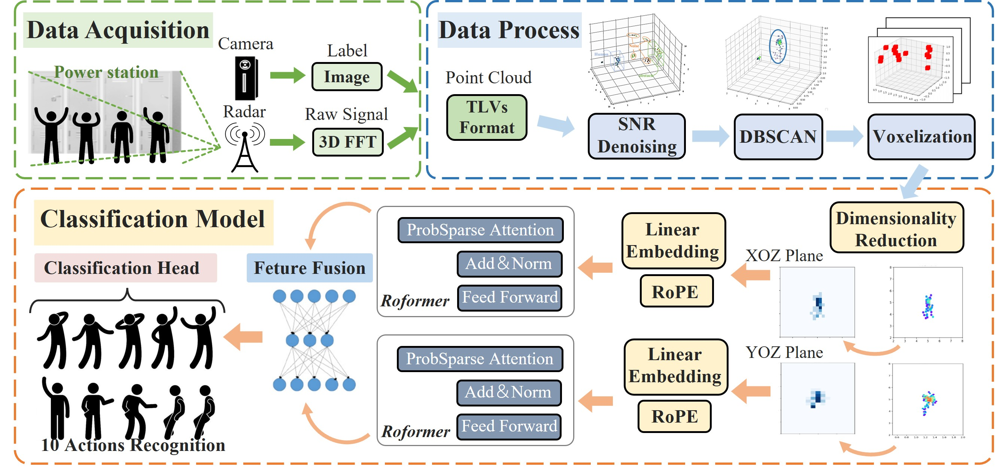
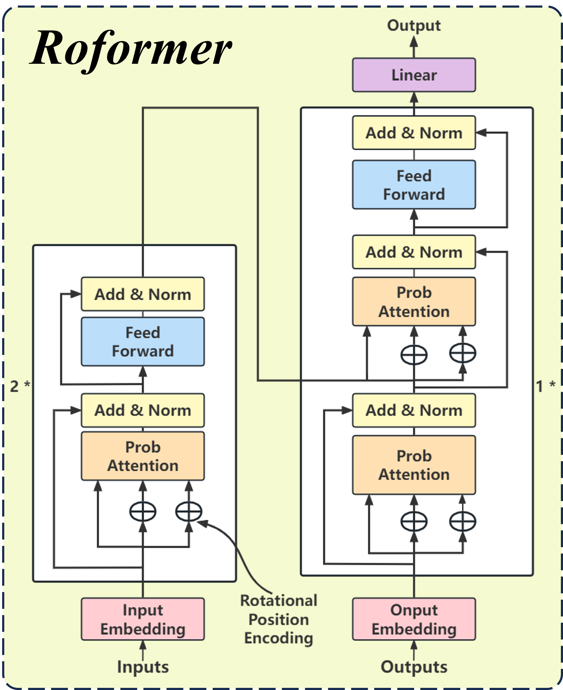

# RoPEHAR: A Real-Time Rotary Position Encoding Informer for mmWave-Based Human Activity Recognition in Substations

This repository provides the **official implementation, dataset, and GUI demo** for the paper:

> **RoPEHAR: A Real-Time Rotary Position Encoding Informer for mmWave-Based Human Activity Recognition in Substations**  
> *IEEE Internet of Things Journal (under revision)*

RoPEHAR is a **millimeter-wave radar based human activity recognition (HAR) system** designed for **real-world power substation environments**, addressing challenges such as electromagnetic interference, privacy preservation, and real-time deployment constraints.

---

## 📌 Highlights

- 📡 mmWave radar–based human activity recognition (TI IWR1843BOOST)
- 🧠 Roformer: Informer enhanced with Rotary Position Encoding (RoPE)
- 🧹 Hybrid SNR–DBSCAN denoising for EMI-robust point cloud extraction
- ⚡ Real-time and lightweight inference pipeline
- 🗂 Public dataset and reproducible processing pipeline
- 🖥 GUI-based visualization and inference demo

---

## 📐 System Overview

<p align="center">
  
</p>

**Processing pipeline:**

1. Raw FMCW radar signals → TLV packets  
2. SNR-based filtering and DBSCAN clustering  
3. Point cloud projection and voxelization  
4. Roformer-based spatiotemporal modeling  
5. Real-time activity classification  

---

## 🧠 Roformer Architecture

<p align="center">
  
</p>

**Key characteristics:**

- ProbSparse Attention for long temporal sequences
- Rotary Position Encoding (RoPE) for relative spatiotemporal modeling
- Dual-plane voxel projection (XOZ / YOZ)
- Efficient temporal feature fusion for real-time HAR

---

## 📁 Repository Structure

```bash
mmWave-RoPEHAR/
├── binData/                    # Dataset
│   ├── traindata/              # Training data (10 action classes)
│   │   ├── 0static/
│   │   ├── 1squat/
│   │   ├── 2stand/
│   │   └── ...
│   └── processed_data/        # Preprocessed voxel data
├── fig/                       # Figures and visualizations
├── gui/                       # GUI application
├── rope_informer/             # Core model implementation
├── model_checkpoint/          # Saved model weights
├── main.py                    # Main entry point for training / evaluation pipeline
├── train_gpu.sh               # Shell script for GPU-based training
├── train.py                   # Model training script
├── predict.py                 # Inference / prediction script
├── PreDataset.py              # Dataset loader and preprocessing logic (Python)
├── Voxel.py                   # Point cloud voxelization and projection utilities
├── RoPEHAR.py                 # RoPEHAR model definition (Roformer + RoPE)
├── RoPEHAR.ipynb              # Jupyter notebook for exploratory experiments
├── results/                   # Experiment outputs
├── requirements.txt           # Python dependencies
└── README.md       
```
---

## Dataset Description

- **Sensor**: Texas Instruments IWR1843BOOST millimeter-wave radar  
- **Environment**: Real-world indoor power substation  
- **Participants**: 4 electrical workers (2 male, 2 female)  
- **Action classes**: 10 typical substation operation activities  
- **Total samples**: 24,000  
- **Annotations**: Frame-level action labels with temporal boundaries  

### Action List

| ID | Action Name |
|----|-------------|
| 0  | Static posture |
| 1  | Squatting |
| 2  | Standing |
| 3  | Falling |
| 4  | Opening cabinet door |
| 5  | Operating switch |
| 6  | Closing cabinet door |
| 7  | Trolley swinging |
| 8  | Rotational operation |
| 9  | Hanging safety sign |

---

## Quick Start

1. Environment Setup
   ```bash
    git clone https://github.com/YourUsername/mmWave-RoPEHAR.git  
    cd mmWave-RoPEHAR  

    conda create -n ropehar python=3.9  
    conda activate ropehar  
    pip install -r requirements.txt  

Required packages include PyTorch, NumPy, SciPy, scikit-learn, and matplotlib.

2. Data Collection
    ```bash    
    cd gui
    python gui_main.py

The GUI supports the following functionalities:

- Real-time or offline point cloud visualization
- Collection of data in bin format and xlsx format

---

3. Model Training
    ```bash
    cd rope_informer
    python scripts/train.py

This command starts training the RoPEHAR model using the provided dataset and default configuration.

---

4. Model Evaluation
    ```bash
    python scripts/predict.py

This command evaluates the trained model on the test split.

---

## Reproducibility and Data Availability

The complete preprocessing, training, and inference pipeline is provided in this repository to support reproducibility.

The dataset is publicly available in this repository for research and verification purposes.
Upon final acceptance of the corresponding journal paper, a stable and citable version of the dataset will be archived on Zenodo or IEEE DataPort, together with a detailed data card describing the collection protocol, radar configuration, and usage guidelines.

---

## Citation

@article{huang2025ropehar,
  title={RoPEHAR: A Real-Time Rotary Position Encoding Informer for mmWave-Based Human Activity Recognition in Substations},
  author={Huang, Jiacheng and Liao, Honglin and Yin, Cunyi and Jiang, Hao and Chen, Jing and Huang, Zhaoke and Chen, Zhiwen},
  journal={IEEE Internet of Things Journal},
  year={2025}
}

---

## Contact

Jiacheng Huang
School of Electrical and Electronic Engineering
Nanyang Technological University, Singapore
Email: jiacheng008@e.ntu.edu.sg

---

## License

This repository is released for academic research only.  
For commercial usage, please contact the authors.  
This project is licensed under the MIT License.
